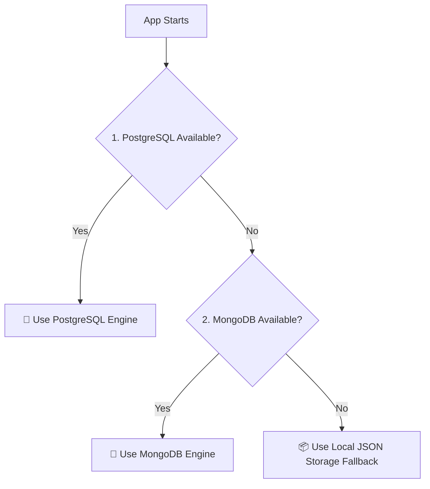

# 🖥️ FAQ & Ticket Management System — Backend Features Specification

This document details all backend architectures, engines, database adapters, and API features implemented in the **FAQ & Ticket Management System**.

---

## 🧭 1. Unified Database Layer & Repository Pattern

The system uses a unified data connector in [db.js](file:///c:/code/vins/Faq---System/backend/config/db.js) that automatically negotiates and falls back through three database storage engines on startup:

### Features:
1.  **ElephantSQL/PostgreSQL Engine:**
    *   Initiates connection pools using the `pg` library.
    *   Executes auto-migrations to initialize the tabular database schema (`users`, `queries`, `faqs`, `forums`, `posts`, `password_resets`) if tables do not exist.
    *   Defines indexes on target columns (e.g., password reset emails).
    *   Provides JSONB mappings for arrays/objects (`tags`, `attachments`, `linkedFAQs`, `votedBy`, `answers`, `helpfulVotes`, `notHelpfulVotes`).
2.  **Mongoose/MongoDB Engine:**
    *   Connects dynamically via Mongoose schema structures as a primary database fallback.
    *   Uses schema validations for constraints.
3.  **Local Storage JSON Engine (`localDb.js`):**
    *   Fallback zero-dependency local mock database storing data in `.json` files inside the [local_data/](file:///c:/code/vins/Faq---System/backend/local_data) directory.
    *   Implements an asynchronous query matching engine (`find`, `findOne`, `create`, `findByIdAndUpdate`, `findByIdAndDelete`) that mirrors the Mongoose API.

---

## 🔐 2. Authentication, Security, & JWT Session Engine

The authentication engine provides session isolation, secure password hashing, and role checks:

*   **Bcrypt Hashing:** Uses `bcryptjs` to salt and hash user passwords (rounds = 10) during registration and credential updates.
*   **JWT Bearer Tokens:** Signs and issues standard JSON Web Tokens on successful login, verifying caller identity in client request headers (`Authorization: Bearer <token>`).
*   **Access Middleware ([auth.js](file:///c:/code/vins/Faq---System/backend/middleware/auth.js)):**
    *   `auth`: Parses and validates tokens, binding the current user payload (`id`, `role`) to `req.user`.
    *   `adminOnly`: Guards route access to queries, database tables, and rosters, permitting only the `admin` role.

---

## 📧 3. Nodemailer Password Reset Flow

Secures credentials recovery via token-based mail flows:

*   **Token Dispatcher:** Generates secure temporary tokens and stores them in the database with timestamps.
*   **Console Logging Fallback:** If `EMAIL_USER` or `EMAIL_PASS` is empty (Local/Dev mode), it automatically intercepts the reset flow and logs the validation url link directly to the console for development testing.
*   **Expiration Enforcement:** Validates temporary tokens and verifies token timestamp freshness within the `RESET_TOKEN_EXPIRY_MIN` window (defaulting to 15 minutes) before permitting credential changes.

---

## 🎫 4. Helpdesk ticket lifecycle Engine

Controls the full ticketing pipeline from request submission to final solution publishing:

*   **Atomic Claim Engine:** Employs atomic operations to claim tickets. Moving status from `PENDING` to `REVIEWING` is restricted to one moderator, avoiding race conditions.
*   **Moderator Workspace:** Allows moderator assignees to post resolution answers and associate related FAQs (`linkedFAQs`).
*   **Query Helpful/Not Helpful Rating:**
    *   Logged-in users can rate resolved tickets using the `/helpful` route, voting `helpful` or `notHelpful`.
    *   Aggregates totals (`helpful` & `notHelpful` count fields) and records voter user IDs (`helpfulVotes`, `notHelpfulVotes` arrays) to prevent duplicate votes per query.
*   **Approval Pipeline:** Admins review resolved queries. Approvals change statuses to `APPROVED` and automatically trigger the compilation and publishing of a new FAQ entity based on the ticket details.
*   **Escalation and Rejection Queues:** Provides routes to escalate tickets back to administrative review (`ESCALATED` status) or flag them as `REJECTED` with reason fields.

---

## 💬 5. Chatbot Engine & LLM Proxy

Supports smart chatbot workflows through two matching layers:

1.  **NLP Keyword Matching Layer:**
    *   Uses a content scoring algorithm in [chatbotController.js](file:///c:/code/vins/Faq---System/backend/controllers/chatbotController.js) to clean messages of common stop words.
    *   Scores matching keywords against the FAQ database and resolved query history. Returns high-confidence answers alongside automated related suggestions.
2.  **LLM Proxy Routing:**
    *   Acts as a fallback if keyword matching scores fall below confidence thresholds.
    *   Proxies messages directly to local generative AI API endpoints (e.g. vLLM or LM-Studio running on port `6006`).
3.  **Automatic Ticket Raising:**
    *   Detects user request intentions (e.g., "create ticket", "raise ticket") via keyword regex.
    *   Returns structured ticket drafting prompts and action parameters for the frontend to render form templates.

---

## 🏛️ 6. Discussion Forums & Community Q&A Threads

Implements interactive community-based sharing boards:

*   **Query-Scoped Forums:** Houses conversations on specific queries, allowing users to coordinate, post messages, modify contents, or delete replies.
*   **Community Posts board:**
    *   Enables public threads with text posts, tags, and vote metrics.
    *   Users submit answers, vote on posts/replies, and add custom text reactions (e.g., emoji reactions on solutions).
    *   Post authors can flag an answer as "Accepted", marking it as the official solution.

---

## 🗄️ 7. Administrative SQL Database Inspector

Restricted backend inspector endpoints (`/api/db-view`) enabling real-time database administration:

*   **Row Counters:** Inspects and compiles row statistics across tables (`users`, `queries`, `faqs`, `forums`, `posts`).
*   **Dynamic SQL Builder:**
    *   Checks if active database adapter is PostgreSQL.
    *   Builds SQL expressions on the fly to perform server-side sorting (`sort`, `dir`), pagination (`limit`, `offset`), and columns search filters (`q`).
    *   Returns table metadata and row sets to the admin client.

---

## 📊 8. Database Migration Automation (`migrate.js`)

A custom loader script [migrate.js](file:///c:/code/vins/Faq---System/backend/config/migrate.js) to import files from the JSON database directory to PostgreSQL:
*   Loads local storage documents (`users.json`, `queries.json`, `faqs.json`, `posts.json`).
*   Normalizes schema columns (including default settings and JSONB parsing parameters).
*   Batch-upserts rows using `ON CONFLICT (_id) DO NOTHING` constraints to prevent data collisions.
